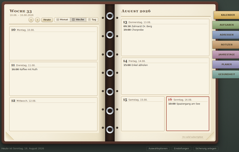
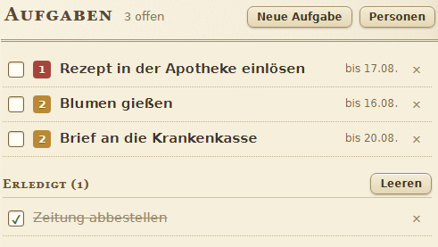

  

  <strong>Dein privater Organizer, gestaltet wie ein echtes Buch.</strong> 
  Kalender, Aufgaben, Kontakte und Notizen für Linux, Windows und Android.

  <strong>Deutsch</strong> · <a href="README.md">English</a> ·
  <a href="https://github.com/maik3531/Magnolie-Organizer/releases/latest">Downloads</a> ·
  <a href="CHANGELOG.md">Änderungen</a>

## Ein persönlicher Organizer statt noch eines Cloud-Kontos

Magnolie bringt das vertraute Gefühl eines ledergebundenen Papier-Organizers auf
Rechner und Smartphone. Termine, Aufgaben, Kontakte, Notizen, Jahrestage,
Planung und Gesundheitsdaten bleiben zusammen. Im Mittelpunkt stehen lokale
Speicherung und bewusst freigegebener Datenaustausch.

- **Eine gemeinsame Gestaltung:** Leder, Papier, Ringe und Register auf allen Geräten.
- **Lokal zuerst:** Der primäre Datenbestand bleibt auf deinen Geräten.
- **Privater Abgleich:** Der Magnolienbaum tauscht freigegebene Inhalte direkt
  über das lokale Netz, VPN oder einen eingerichteten Fernendpunkt aus.
- **Praktische Einfuhr:** Kalender, vCards, Lotus-Organizer-Daten und verbreitete Notizexporte.
- **Barrierearm:** Tastaturbedienung, zuschaltbare Hilfsrahmen und anpassbare Ansichten.
- **20 Oberflächensprachen:** darunter Deutsch, Englisch, Französisch, Spanisch,
  Arabisch, Japanisch und Ukrainisch.

## Herunterladen

| Plattform | Empfohlenes Paket | Alternative |
|---|---|---|
| Linux | [Flatpak x86_64](https://github.com/maik3531/Magnolie-Organizer/releases/latest/download/Magnolie-Organizer-2.0.21-x86_64.flatpak) | [AppImage](https://github.com/maik3531/Magnolie-Organizer/releases/latest/download/Magnolie-Organizer-2.0.21-x86_64.AppImage) · [Debian-Paket](https://github.com/maik3531/Magnolie-Organizer/releases/latest/download/magnolie-organizer_2.0.21_all.deb) |
| Windows 10/11 x64 | [Installationsprogramm](https://github.com/maik3531/Magnolie-Organizer/releases/latest/download/Magnolie-Organizer-Windows-2.0.21-Setup-x64.exe) | [Portable ZIP](https://github.com/maik3531/Magnolie-Organizer/releases/latest/download/Magnolie-Organizer-Windows-2.0.21-x64.zip) |
| Android | [Magnolie Notes APK](https://github.com/maik3531/Magnolie-Organizer/releases/latest/download/Magnolie-Notes-1.0.15.apk) | Android 8.0 oder neuer |
| Handbuch | [Debian-Paket](https://github.com/maik3531/Magnolie-Organizer/releases/latest/download/magnolie-handbuch_2.0.21_all.deb) | Optionale Komponente des Windows-Installers |

Optionale KDE-Integration für das native Linux-Paket:

| Distribution | KDE-Paket (amd64 / x86_64) |
|---|---|
| Debian 13, Ubuntu / Kubuntu 24.04 und 26.04, Linux Mint 22 | [Ein KDE-DEB](https://github.com/maik3531/Magnolie-Organizer/releases/latest/download/magnolie-organizer-kde_2.0.21_amd64.deb) |
| Fedora 42 | [KDE-RPM](https://github.com/maik3531/Magnolie-Organizer/releases/latest/download/magnolie-organizer-kde-2.0.21-1.fc42.x86_64.rpm) |

Das optionale KDE-DEB wählt eines von drei internen nativen Backends anhand der
bereits konfigurierten KDE-Pakete und ihrer vollständigen ABI-Abhängigkeiten.
Es installiert keine KDE-PIM-Suite. Es gibt keinen Übergangspaket-Download.
Beim alten Paketnamen wird `magnolie-organizer-kde` ausdrücklich installiert;
versionierte Paketbeziehungen erhalten das Upgrade von der freigegebenen 1.0.0.
Die suffixierten 2.0.19-Dateien waren unveröffentlichte Testkandidaten und werden
von dpkg höher als 2.0.19 einsortiert: Ihr Ersatz braucht eine ausdrückliche
Downgrade-Entscheidung des Testers. Siehe [KDE-Anforderungen und Upgrade-Regeln](magnolie-organizer/native/akonadi-helper/DEB-TARGETS.md).

SHA-256-Prüfsummen und Quellarchive liegen in der
[aktuellen Freigabe](https://github.com/maik3531/Magnolie-Organizer/releases/latest).

## Einblick

<table>
  <tr>
    <td width="50%"></td>
    <td width="50%"></td>
  </tr>
  <tr>
    <td align="center"><strong>Die Woche auf einen Blick</strong></td>
    <td align="center"><strong>Aufgaben übersichtlich verwalten</strong></td>
  </tr>
</table>

   
  <strong>Kontakte wie vertraute Karteikarten</strong>

## Projektfamilie

| Bestandteil | Technik | Quellen |
|---|---|---|
| Magnolie Organizer für Linux | Python 3, GTK 3, WebKit2GTK | [`magnolie-organizer`](magnolie-organizer/) |
| Magnolie Organizer für Windows | C#, .NET 8, WinForms, WebView2 | [`magnolie-organizer-windows`](magnolie-organizer-windows/) |
| Magnolie Notes für Android | Kotlin, Jetpack Compose | [`magnolie-notes`](magnolie-notes/) |
| Magnolie-Handbuch | Python, GTK, HTML/CSS/JavaScript | [`magnolie-handbuch`](magnolie-handbuch/) |

Das Repository enthält die veröffentlichten Quellen für Organizer 2.0.21
und Notes 1.0.15. Fertige
Pakete bleiben auf der Releases-Seite und belasten nicht die Git-Historie.

## Sicherheit und Datenschutz

Magnolie setzt auf lokale Dateien, verschlüsselten Datenaustausch und
ausdrückliches Vertrauen zwischen gekoppelten Geräten. Signierschlüssel,
Zugangsdaten und private Konfigurationen gehören nicht in dieses Repository.
Sicherheitsprobleme bitte vertraulich nach [SECURITY.md](SECURITY.md) melden.

## Mitwirken

Fehlerberichte, Übersetzungen und klar abgegrenzte Verbesserungen sind
willkommen. Hinweise stehen in [CONTRIBUTING.md](CONTRIBUTING.md). Bitte die
Issue-Vorlagen verwenden und Änderungen möglichst auf einen Bestandteil begrenzen.

## Lizenz

Programm- und Handbuchquellen stehen unter **GPL-3.0-or-later**, soweit eine
Datei nichts anderes nennt. Mitgelieferte Schriften behalten ihre eigenen
Lizenzen. Für den geschützten Kaffee-QR und das Porträt gilt der gesonderte
[Nutzungshinweis](PROTECTED-ASSETS-LICENSE.txt).
Eine Übersicht steht in [LICENSE.md](LICENSE.md).
