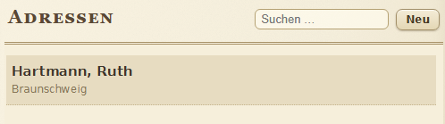

  

  <strong>Your private organizer, designed like a real book.</strong> 
  Calendar, tasks, contacts and notes for Linux, Windows and Android.

  <a href="README.DE.md">Deutsch</a> · <strong>English</strong> ·
  <a href="https://github.com/maik3531/Magnolie-Organizer/releases/latest">Downloads</a> ·
  <a href="CHANGELOG.md">Changelog</a>

  
  
  
  

## A personal organizer, not another cloud account

Magnolie brings the familiar feeling of a leather-bound paper organizer to the
desktop and phone. It keeps appointments, tasks, contacts, notes, anniversaries,
planning and health records together while putting local storage and explicit
sharing first.

- **One visual language:** leather, paper, rings and tabs across desktop and mobile.
- **Local-first:** your primary data stays on your devices.
- **Private synchronization:** Magnolienbaum exchanges approved content directly
  over the local network, VPN or a configured remote endpoint.
- **Useful imports:** calendars, vCards, Lotus Organizer data and common note exports.
- **Accessible:** keyboard navigation, optional focus outlines and scalable layouts.
- **20 interface languages:** including English, German, French, Spanish, Arabic,
  Japanese and Ukrainian.

## Download

| Platform | Recommended package | Alternative |
|---|---|---|
| Linux | [Flatpak x86_64](https://github.com/maik3531/Magnolie-Organizer/releases/latest/download/Magnolie-Organizer-2.0.12-x86_64.flatpak) | [AppImage](https://github.com/maik3531/Magnolie-Organizer/releases/latest/download/Magnolie-Organizer-2.0.12-x86_64.AppImage) · [Debian package](https://github.com/maik3531/Magnolie-Organizer/releases/latest/download/magnolie-organizer_2.0.12_all.deb) |
| Windows 10/11 x64 | [Setup](https://github.com/maik3531/Magnolie-Organizer/releases/latest/download/Magnolie-Organizer-Windows-2.0.12-Setup-x64.exe) | [Portable ZIP](https://github.com/maik3531/Magnolie-Organizer/releases/latest/download/Magnolie-Organizer-Windows-2.0.12-x64.zip) |
| Android | [Magnolie Notes APK](https://github.com/maik3531/Magnolie-Organizer/releases/latest/download/Magnolie-Notes-1.0.9.apk) | Android 8.0 or newer |
| Handbook | [Debian package](https://github.com/maik3531/Magnolie-Organizer/releases/latest/download/magnolie-handbuch_2.0.12_all.deb) | Included as an optional Windows component |

SHA-256 checksums and source archives are attached to the
[latest release](https://github.com/maik3531/Magnolie-Organizer/releases/latest).

> [!IMPORTANT]
> The Windows 2.0.12 artifacts are unsigned Linux cross-builds. Source, web,
> package-content and 30,000-item core tests pass, but a current Windows VM run
> was unavailable. Review the release notes before use.

## A look inside

<table>
  <tr>
    <td width="50%"></td>
    <td width="50%"></td>
  </tr>
  <tr>
    <td align="center"><strong>Week at a glance</strong></td>
    <td align="center"><strong>Tasks that stay manageable</strong></td>
  </tr>
</table>

   
  <strong>Contacts presented as familiar index cards</strong>

## Project family

| Component | Technology | Source |
|---|---|---|
| Magnolie Organizer for Linux | Python 3, GTK 3, WebKit2GTK | [`magnolie-organizer-2.0.0`](magnolie-organizer-2.0.0/) |
| Magnolie Organizer for Windows | C#, .NET 8, WinForms, WebView2 | [`Magnolie-Organizer-Windows-2.0.0`](Magnolie-Organizer-Windows-2.0.0/) |
| Magnolie Notes for Android | Kotlin, Jetpack Compose | [`magnolie-notes-1.0.9`](magnolie-notes-1.0.9/) |
| Magnolie Handbook | Python, GTK, HTML/CSS/JavaScript | [`magnolie-handbuch-stamm`](magnolie-handbuch-stamm/) |

Each directory contains its own build and test instructions. The repository
contains the published sources for release 2.0.12 / Notes 1.0.9; generated
packages are kept on the Releases page rather than in Git history.

## Security and privacy

Magnolie is built around local files, encrypted data exchange and explicit trust
between paired devices. No signing keys, credentials or private configuration
belong in this repository. Please report security issues privately as described
in [SECURITY.md](SECURITY.md).

## Contributing

Bug reports, translations and focused improvements are welcome. Start with
[CONTRIBUTING.md](CONTRIBUTING.md), use the issue templates, and keep changes
scoped to one component whenever possible.

## License

Program and handbook sources are licensed under **GPL-3.0-or-later** unless a
file states otherwise. Third-party fonts retain their included licenses. The
portrait in the handbook has a separate, limited usage permission documented in
[`maik-walter-FOTO-NUTZUNG.txt`](magnolie-handbuch-stamm/web/maik-walter-FOTO-NUTZUNG.txt).
See [LICENSE.md](LICENSE.md) for the repository-wide overview.
